# Villa Reservation System

## Project Concept

The **Villa Reservation System** is a web application developed with **ASP.NET Core MVC**.
It allows users to browse holiday villas, make reservations for specific periods, and manage their bookings,
while administrators can manage villas and reservations.

---

## Key Features

- Browse villas with detailed information
- Search available villas by date range
- Make reservations using a modal form
- Automatic price calculation based on number of nights
- Role-based access: User and Admin
- AJAX-driven interactions without page reloads
- Client-side and server-side validation

---

## Add Villa Functionality (Admin)

The **Add Villa** feature is available only for administrators.
It allows adding new villas with details such as location, description, capacity, and pricing.
Validation is enforced using **Data Annotations**, and business logic is implemented in the service layer.

### Add Villa Form – Example Screenshot


<!--*Image source: Unsplash (free to use)*-->

---

## Reservation Modal

Users can make reservations using a dynamic modal window.
Dates are selected via a date picker, unavailable dates are disabled, and the total price is calculated instantly using JavaScript.


## Admin Management Interface

Administrators can edit villas, edit reservations, and delete reservations created by users.

### Admin Panel – Example Screenshot

<!---->

---
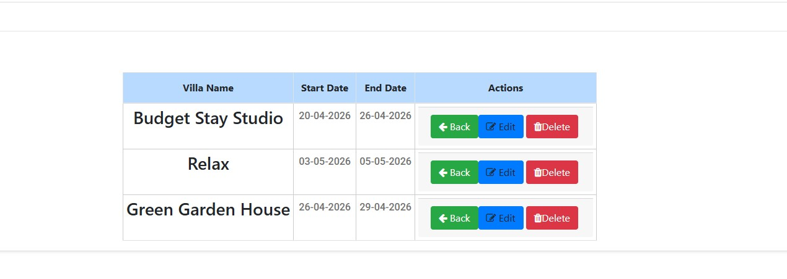

## All Villas

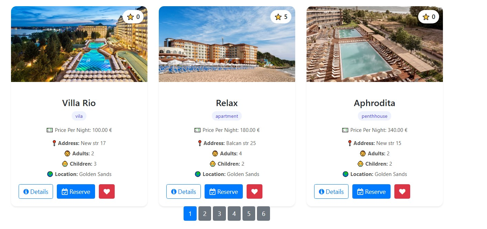
## Architecture

The application follows a layered architecture:

- **Controllers** – Handle HTTP requests and responses
- **Services** – Contain business logic
- **Data Layer** – Entity Framework Core (Code First)
- **ViewModels** – Data transfer and validation
- **Views & Partial Views** – Razor UI components

---

## Validation

- **Client-side validation**: JavaScript for immediate user feedback
- **Server-side validation**: Data Annotations in ViewModels
- Ensures both usability and data integrity

---

## Database & Seeding

- Entity Framework Core (Code First)
- Fluent API for relationships
- Automatic seeding of:
  - Roles (Admin, User)
  - Test users
  - Reference data

---

## Setup Instructions

1. Update the connection string in `appsettings.json`
2. Open **Package Manager Console**
3. Run:
   ```powershell
   Update-Database

   You can test with users and admin:
   email = "admin@horizons.com";
   password = "Admin123!";
   email = "silviya.kab@gmail.com";
   password = "55555777";
   email = "jane@gmail.com";
   password = "111111";

Before Start it is needed to set AzureEscape in Web folder as Start Page.
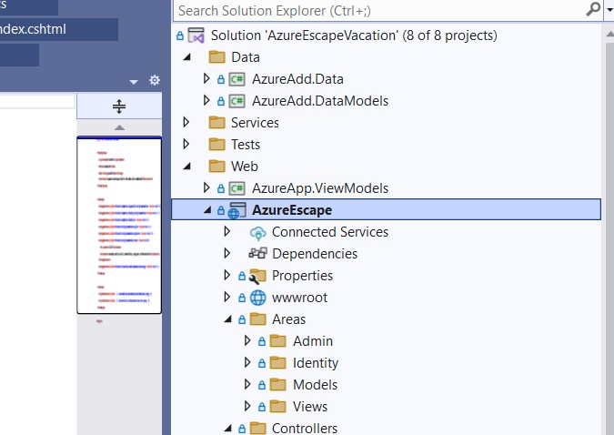


After start the project the users and roles will be seeded and you can test with them.

# Screenshot Preview


## Start Page

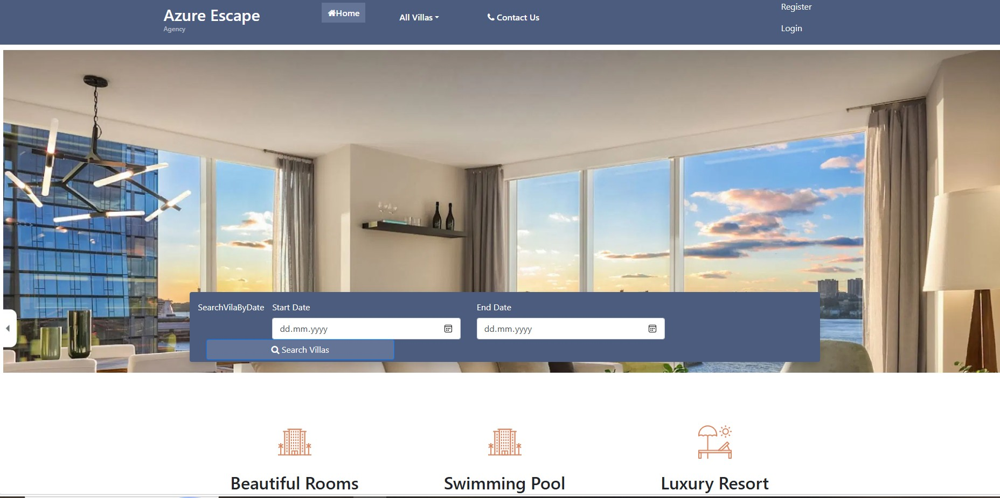


## Search by Period 

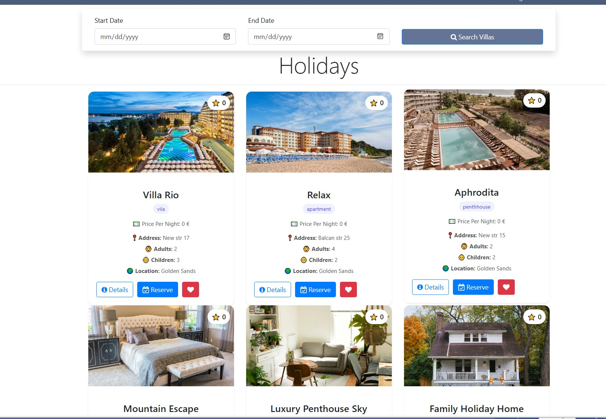

## All Villas


## Make Reservation

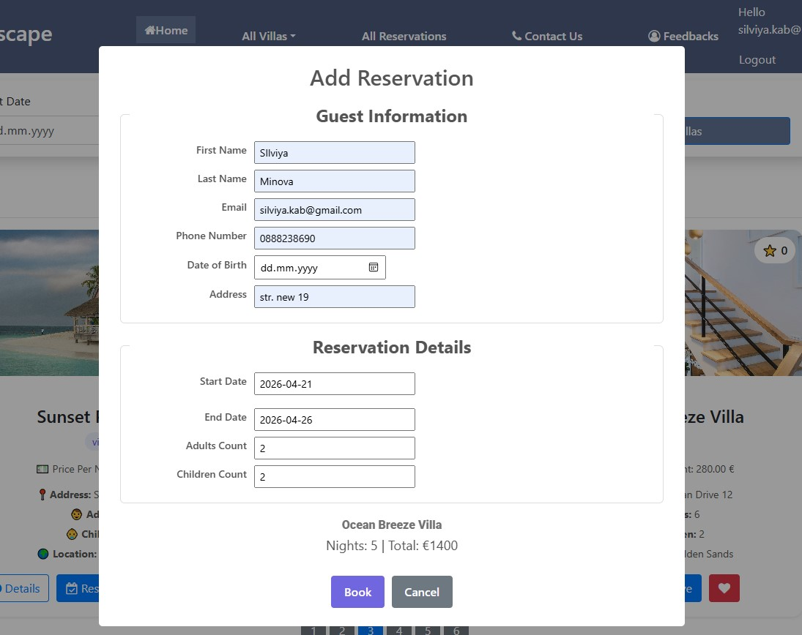
<!---->


## Edit Reservation

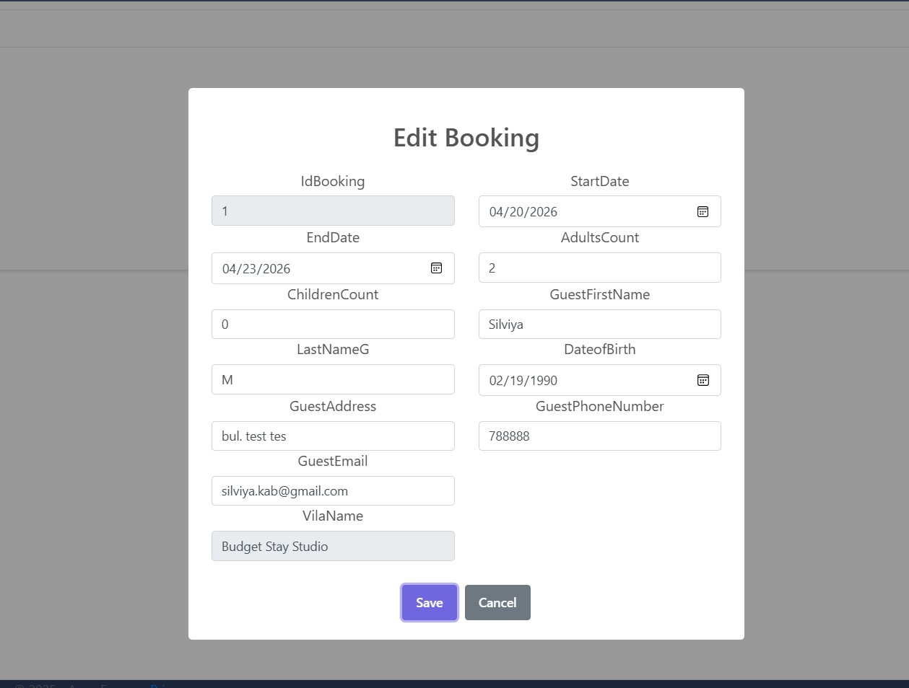


## Feedbacks
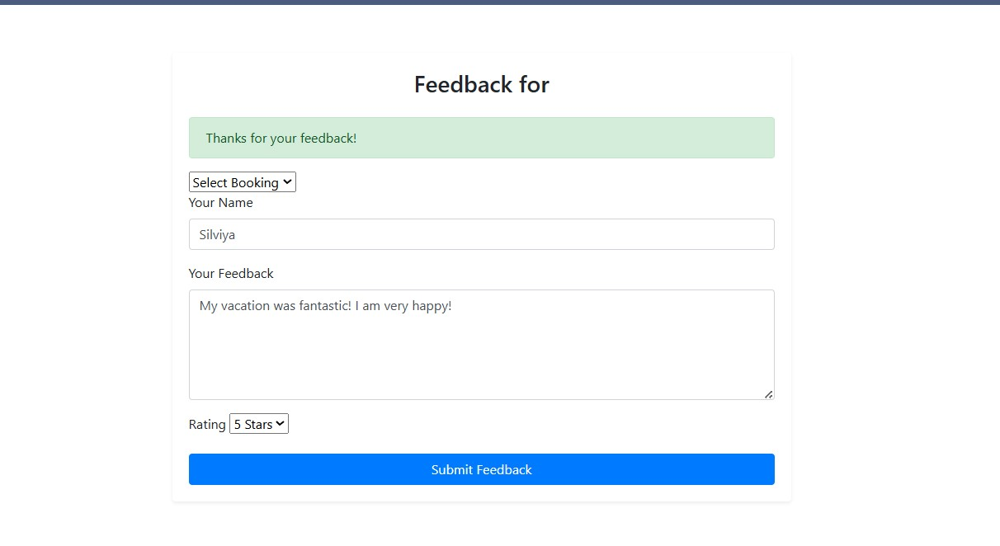

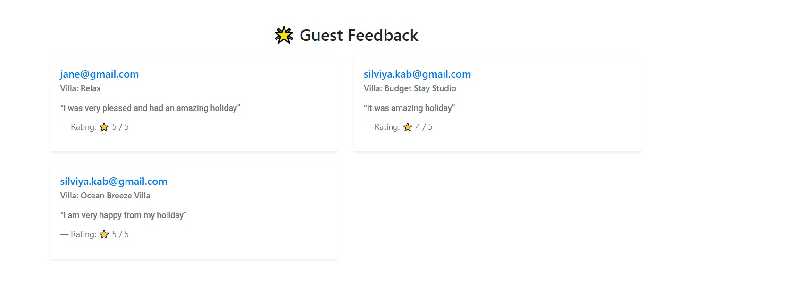
<!--


<!--https://images.unsplash.com/photo-1600585154340-be6161a56a0c-->

## All Favorite Places

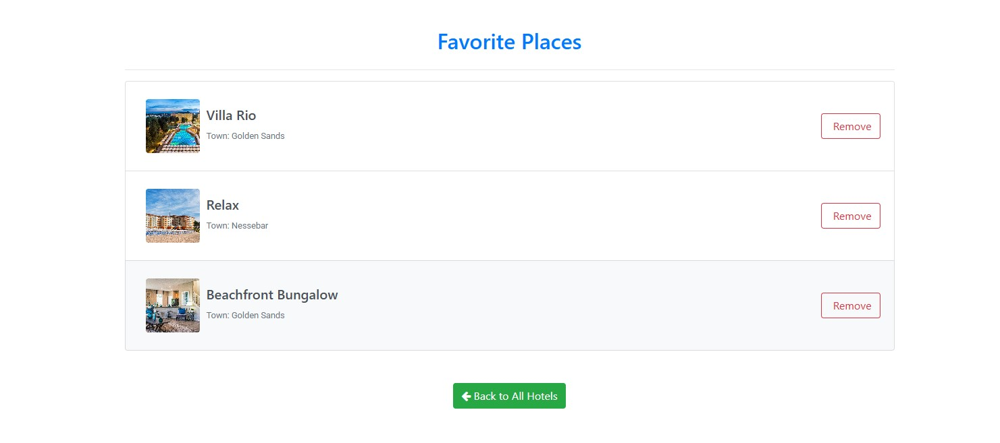

### Admin Area functionality
## Add Villa

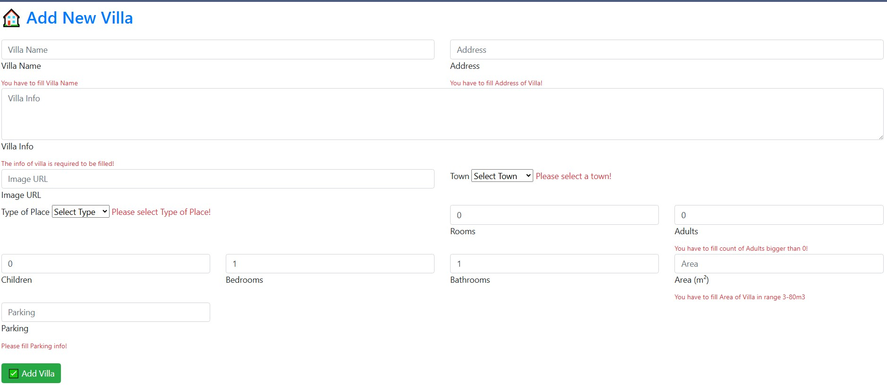

## All Vilas User
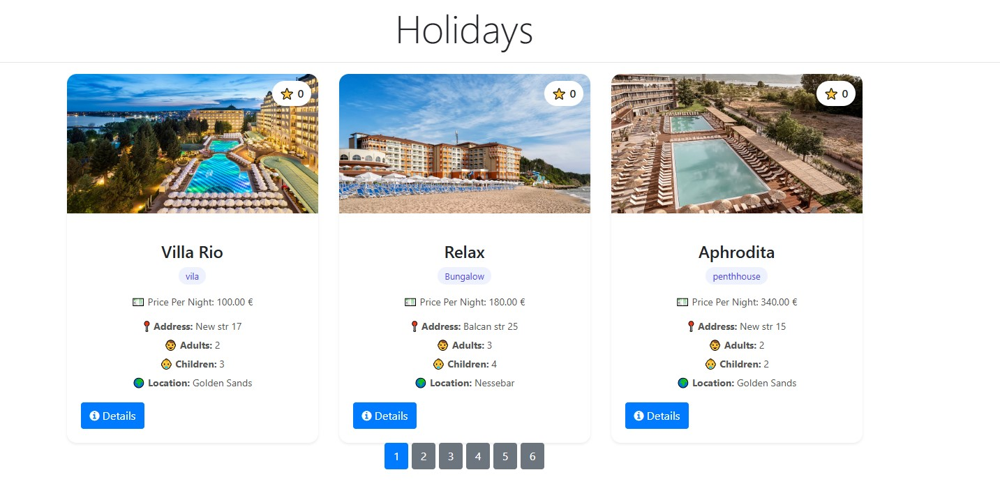

## All Reservations


## All Reservations
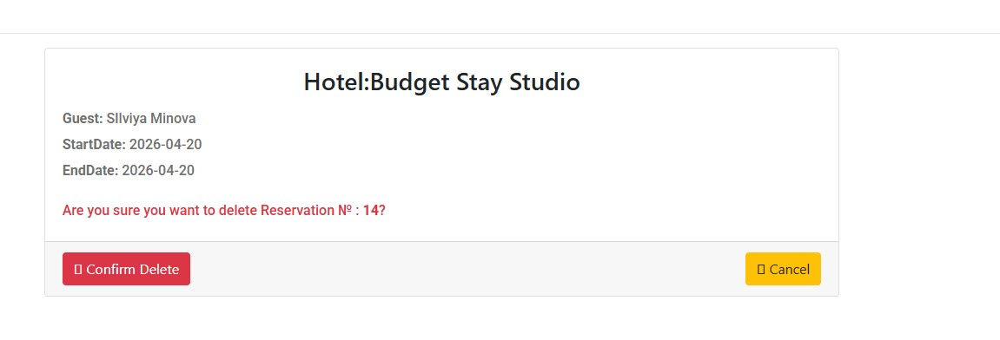

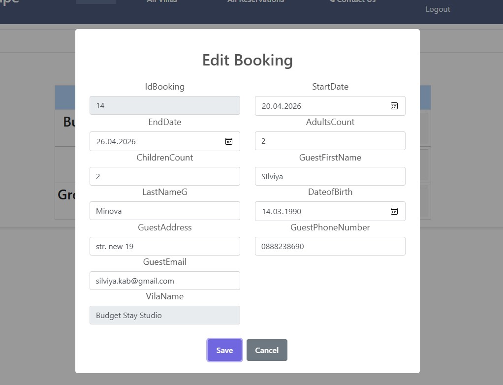


## Success

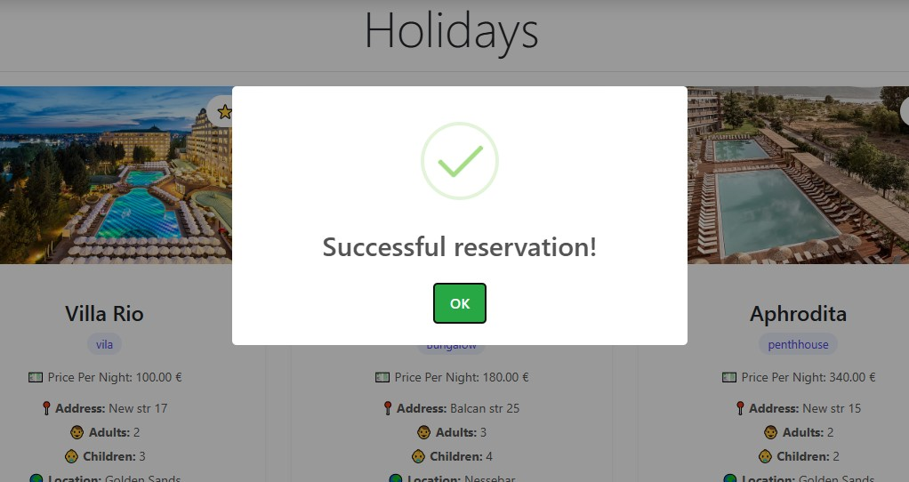